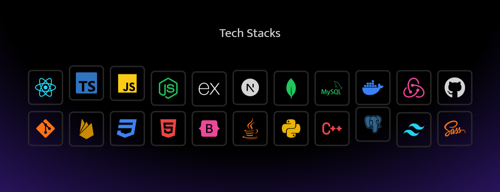
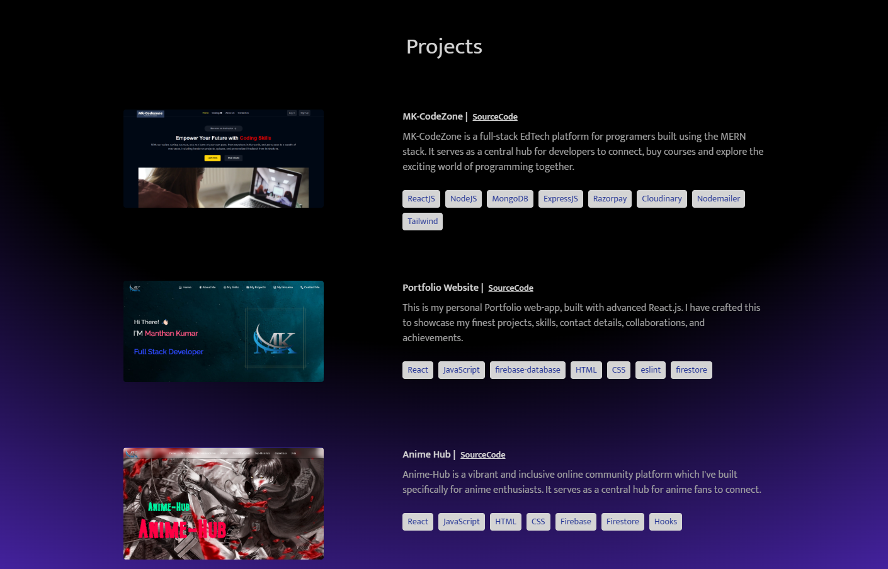

# MERN-MK-website

## => MERN-mk-website is a modern web application built using the MERN stack, featuring a React.JS front-end.This project utilizes MongoDB for data management and Express.js for backend server.

## Website Link => https://manthan-mk-mern.vercel.app

## Project's Screenshots =>





## Technologies Used

- **MongoDB**: Database
- **Express.js**: Backend Server
- **React.js**: Frontend Framework
- **Node.js**: Backend Runtime Environment

<h2>Getting Started</h2>

1. To get started with this project, you will need to have `Node.js` and `NPM` installed on your system.

2. First, you need to open a `Terminal` in your system and `Clone` this repository by using :

```bash
git clone https://github.com/Mk4Levi/mern-mk-website.git
```

3. Navigate to the Project's directory :

```bash
cd mern-mk-website
```

4. Install all Dependencies used in this Project :

   ```sh
   Frontend- npm install
   Backend- 1. cd server 2. npm install

   ```

5. Start the development server

   ```sh
   Frontend- npm run dev
   Backend- 1. cd server  2. npm run dev
   ```

6. Now just search this link in your browser to view the live running application in your Local sysytem :

```bash
http://localhost:5173
```

<h2>Paths & Files</h2>

### Structure of the Folders & Files in this Repo :

```text
.
├── backend/
├── public/
├── src
│   ├── assets/
│   ├── components/
|         └── MemberCard.jsx
|         └── Form.jsx
|         └── MangaCard.jsx
│         └── Navbar.jsx
│         └── PreLoader.jsx
│         └── Socials.jsx
|         └── RecommendationCard.jsx
│         └── index.js
│
│   ├── config/
|         └── firebaseConfig.js
│         └── index.js
│
│   ├── database/
|         └── data.js
│         └── images.js
|         └── index.js
│
│   ├── pages/
|         └── AboutMe.jsx
│         └── Members.jsx
|         └── Manga.jsx
|         └── Guidelines.jsx
|         └── Home.jsx
│         └── Register.jsx
|         └── Characters.jsx
|         └── Recommendation.jsx
|         └── index.js
|
│   ├── App.jsx
│   ├── index.jsx
│   ├── vercel.json
│
├── .eslintrc.json
├── .gitattributes
├── .gitignore
├── index.html
├── package-lock.json
├── package.json
├── README.md
├── vite.config.js

```

# Thank You
